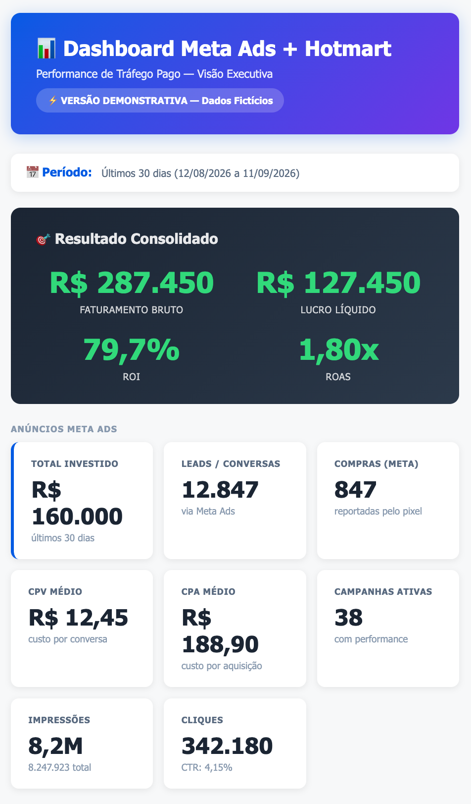
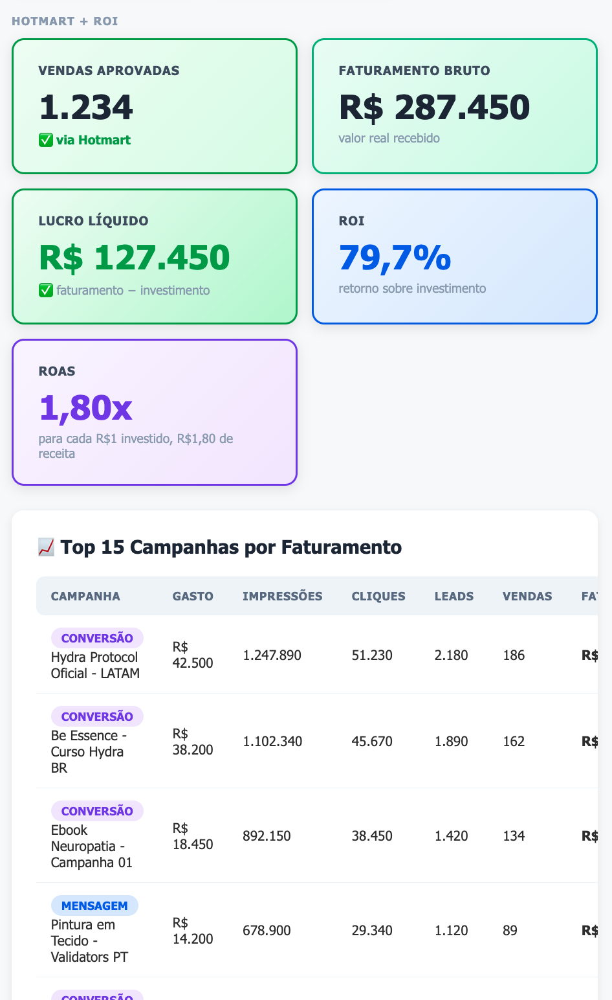
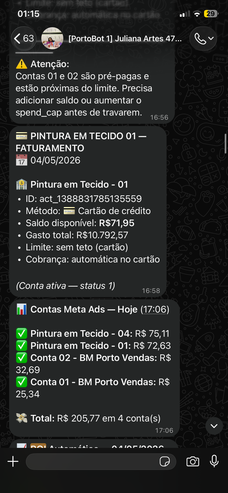
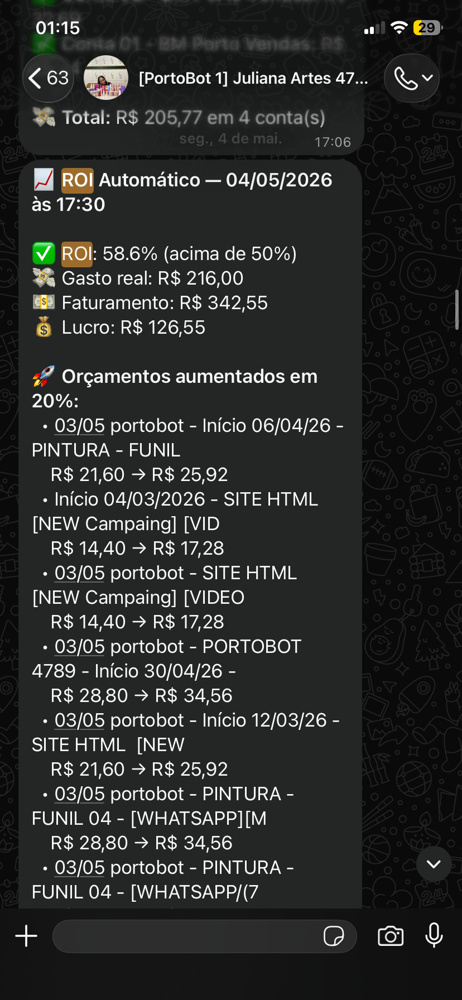

# Dashboard ROI Meta Ads + Hotmart

**Demo Online:** [https://porto-studio.github.io/dashboard-roi/](https://porto-studio.github.io/dashboard-roi/)

Dashboard de Business Intelligence que conecta dados de mídia paga (Meta Ads) com vendas (Hotmart) para calcular ROI, ROAS e CPA em tempo real, com sistema de alertas automatizado.

---

## 🎯 O Que Este Sistema Faz

Este não é um dashboard de visualização passiva. É um **motor de decisão operacional** que:

1. **Coleta** dados de Meta Ads (gasto, campanhas, conversões)
2. **Cruza** com vendas da Hotmart (faturamento, transações)
3. **Calcula** ROI operacional em tempo real
4. **Classifica** campanhas (escalar, otimizar, monitorar, pausar)
5. **Alerta** via WhatsApp com recomendações acionáveis

```
Meta Ads                Hotmart
   │                       │
   ├─ Gasto                ├─ Vendas aprovadas
   ├─ Campanhas            ├─ Faturamento bruto
   ├─ Impressões           └─ Período
   ├─ Cliques
   ├─ Conversões
   └─ CPA
        │
        ▼
   ┌─────────────────────┐
   │   CÁLCULO DE ROI    │
   │                     │
   │ Lucro = Fat - Invest│
   │ ROI% = (Lucro/Invest)×100│
   │ ROAS = Fat/Invest   │
   └─────────────────────┘
        │
        ▼
   ┌─────────────────────┐
   │ MOTOR DE DECISÃO    │
   │                     │
   │ ROI ≥ 50%  → SCALE  │
   │ ROI 20-50% → OPTIMIZE│
   │ ROI 0-20%  → MONITOR │
   │ ROI < 0    → PAUSE   │
   └─────────────────────┘
        │
        ▼
   ┌─────────────────────┐
   │  ALERTA WHATSAPP    │
   │                     │
   │ Resumo diário       │
   │ Piores campanhas    │
   │ Recomendações       │
   └─────────────────────┘
```

---

## 🚀 Demo Online

**Acesse a demonstração com dados fictícios:**

🔗 [https://porto-studio.github.io/dashboard-roi/](https://porto-studio.github.io/dashboard-roi/)

> ⚠️ **VERSÃO DEMONSTRATIVA — DADOS FICTÍCIOS**
> 
> Esta é uma versão estática com dados sintéticos. Para conectar APIs reais, é necessário rodar o sistema localmente com credenciais válidas.

**Screenshots:**

| Dashboard Principal | Ranking de Campanhas |
|-------------------|----------------------|
|  |  |

| Alerta WhatsApp | ROI Automático |
|-----------------|----------------|
|  |  |

---

## 📊 Métricas Calculadas

| Métrica | Fórmula | Quando Usar |
|---------|---------|-------------|
| **Gasto Total** | Σ(spend Meta Ads) | Controle de investimento |
| **Faturamento Bruto** | Σ(valor vendas Hotmart) | Receita total |
| **Resultado Operacional** | Faturamento − Gasto | Lucro antes de custos |
| **ROI** | (Resultado ÷ Gasto) × 100 | % de retorno sobre investimento |
| **ROAS** | Faturamento ÷ Gasto | Quanto cada R$1 gera em receita |
| **CPA** | Gasto ÷ Compras | Custo de aquisição por cliente |
| **CPV** | Gasto ÷ Conversões | Custo por visualização/lead |

> ⚠️ **Nota sobre "Lucro":** O cálculo mostra "resultado operacional" (faturamento − investimento), não lucro líquido. Não desconta: taxas Hotmart (~10%), impostos, chargebacks, reembolsos, custo do produto, logística. Para lucro líquido real, adicionar essas variáveis.

---

## 🏆 Destaques Técnicos

### 1. Integração Real de APIs
- Meta Ads Graph API v21.0 (direta)
- Hotmart Payments API v1 (via proxy CORS)
- OAuth2 client_credentials
- Renovação automática de tokens

### 2. Multi-Conta
- Suporta múltiplas contas de anúncios
- Modo conta única OU grupo mesclado
- Cache inteligente por período

### 3. Single-File Architecture
- Dashboard completo em 1 arquivo HTML
- Zero dependências frontend
- CSS e JavaScript inline
- Carregamento instantâneo

### 4. Persistência Local
- localStorage para configuração
- Snapshots JSON diários
- Exportação CSV
- Reutilização de dados passados

### 5. Modo Conferência
- Lista todos os BMs acessíveis
- Status de cada conta
- Detecção de débitos

---

## 🛠️ Como Rodar Localmente

### Pré-requisitos
- Python 3.10+
- Navegador moderno (Chrome, Firefox, Safari)
- Token Meta Ads (longa duração)
- Credenciais Hotmart API

### Passos

1. **Clone o repositório:**
   ```bash
   git clone https://github.com/adrielportoribeiro/dashboard-roi.git
   cd dashboard-roi
   ```

2. **Configure variáveis de ambiente:**
   ```bash
   cp .env.example .env
   # Edite .env com seus tokens
   ```

3. **Instale dependências:**
   ```bash
   pip install -r requirements.txt
   ```

4. **Inicie o proxy:**
   ```bash
   python3 hotmart_proxy.py
   ```

5. **Abra o dashboard:**
   ```bash
   open roi-dashboard-metaapi.html
   # Ou acesse: http://localhost:8789
   ```

6. **Configure:**
   - Cole seu token Meta no campo "Token Meta"
   - Selecione a conta de anúncios
   - Escolha o período
   - Clique "Sincronizar"

---

## 📁 Estrutura do Projeto

```
dashboard-roi/
├── dashboard-demo-30dias.html    # Demo com dados fictícios (GitHub Pages)
├── roi-dashboard-metaapi.html      # Dashboard completo (requer backend)
├── hotmart_proxy.py                # Proxy Flask para Hotmart API
├── buscar-meta-ads.py              # Script standalone Meta Ads
├── requirements.txt                # Dependências Python
├── .env.example                    # Template de variáveis
├── .gitignore                      # Arquivos ignorados
├── README.md                       # Esta documentação
├── docs/                           # Documentação técnica
│   ├── architecture.md
│   ├── case-study.md
│   ├── metrics.md
│   └── security.md
└── assets/                         # Screenshots
    ├── dashboard-meta-hotmart-main.png
    ├── dashboard-hotmart-roi-top15.png
    ├── whatsapp-anon-01-alertas.png
    ├── whatsapp-anon-02-roi.png
    ├── whatsapp-anon-03-piores.png
    └── whatsapp-anon-04-ranking.png
```

---

## 🔒 Segurança

Este projeto lida com dados sensíveis de marketing e vendas. Implementações de segurança:

- ✅ Tokens armazenados em `.env` (nunca no código)
- ✅ Proxy local para resolver CORS (credenciais não expostas ao browser)
- ✅ Renovação automática de tokens (< 10 dias)
- ✅ Dados salvos localmente (não em nuvem pública)
- ✅ Screenshots anonimizadas (sem dados reais)

**Para uso em produção:**
- Use HTTPS em produção
- Implemente autenticação de usuário
- Valide tokens em backend
- Rotacione credenciais periodicamente

Mais detalhes: [docs/security.md](docs/security.md)

---

## 📚 Documentação

- **[docs/architecture.md](docs/architecture.md)** — Arquitetura técnica
- **[docs/case-study.md](docs/case-study.md)** — Caso de uso real
- **[docs/metrics.md](docs/metrics.md)** — Referência de métricas
- **[docs/security.md](docs/security.md)** — Considerações de segurança

---

## ⚖️ Limitações

1. **Atribuição Indireta:** Hotmart não informa qual campanha gerou cada venda. O cruzamento é por período (total Meta vs total Hotmart), não por campanha individual.

2. **Dependência Local:** Versão completa requer proxy Python rodando localmente.

3. **Cálculo Simplificado:** "Resultado operacional" ≠ lucro líquido. Não inclui todas as variáveis de custo.

4. **Modo Demo:** Apenas dados fictícios no GitHub Pages. APIs reais requerem configuração local.

---

## 🎯 Caso de Uso

**Problema:** Gestor de tráfego gerenciando 17+ contas de Meta Ads precisa cruzar manualmente dados de gasto com vendas para calcular ROI e decidir orçamentos.

**Tempo antes:** 30-60 min/dia por conta (~8-17 horas/dia)

**Tempo depois:** 2-5 minutos para todas as contas

**Economia:** ~99% do tempo operacional

**Impacto:** Decisões em tempo real, escala viável, redução de erro humano, auditabilidade completa.

Mais detalhes: [docs/case-study.md](docs/case-study.md)

---

## 📄 Licença

MIT License — uso educacional e comercial permitido.

---

## 🤝 Contato

Para dúvidas ou sugestões, abra uma issue ou entre em contato.

**Autor:** Adriel Porto Ribeiro

---

*Construído com foco em decisão operacional, não apenas visualização.*
